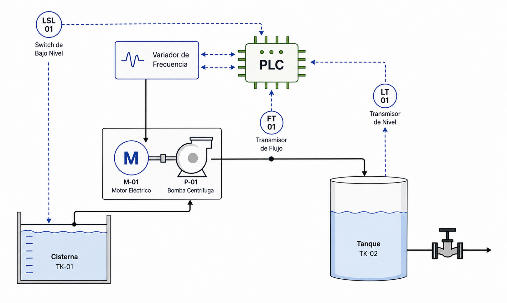
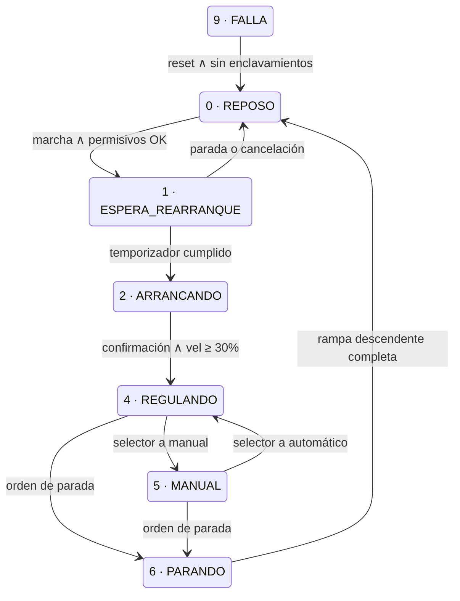

# Portafolio de Automatización Industrial

Estudiante de Ingeniería Electromecánica enfocado en automatización industrial y
en el diseño de sistemas de monitoreo para mantenimiento predictivo.

**PLC Siemens · HMI WinCC · Programación bajo IEC 61131-3**

📍 Tibú, Norte de Santander, Colombia
🔗 [LinkedIn](https://www.linkedin.com/in/jes%C3%BAs-hernando-perez-651948269/)
📧 jesushernando2027@gmail.com

---

## Competencias técnicas

| Área | Herramientas |
|---|---|
| Programación PLC | TIA Portal (STEP 7 Professional), CODESYS |
| Lenguajes | KOP/Ladder, SCL / Texto Estructurado, GRAFCET |
| HMI | WinCC Basic |
| Simulación | PLCSIM, Factory I/O |
| Comunicaciones | PROFINET, Modbus TCP |
| Monitoreo de condición | Adquisición de variables, históricos y tendencias |

---

## Proyecto 1 · Sistema de bombeo con control de nivel

`En desarrollo · entrega estimada octubre 2026`

Control automático del nivel de un tanque de proceso mediante regulación de
velocidad de una bomba centrífuga accionada por variador de frecuencia. El
consumo aguas abajo es variable y no controlado, y constituye la perturbación
principal del lazo.

El sistema incorpora una capa de monitoreo de condición orientada al
mantenimiento predictivo del conjunto motor-bomba.

**Stack:** S7-1500 · TIA Portal V20 · WinCC Basic · PLCSIM · Modbus TCP

**Arquitectura de señales:** 7 entradas digitales · 3 salidas digitales ·
3 entradas analógicas · 1 salida analógica. En fase 2, las señales del variador
migran a comunicación.



### Alcance

- Secuencia de arranque con enclavamientos y tiempo mínimo entre arranques
- Control PID de nivel actuando sobre la velocidad del variador
- Modo manual para mantenimiento, con transición sin salto
- Gestión de alarmas con reconocimiento y registro de marcas de tiempo
- HMI con sinóptico animado, tendencia de nivel y ventana de alarmas
- Parametrización del variador por comunicación
- Monitoreo: horas de operación, número de arranques, corriente del motor y
  relación caudal/velocidad como indicador de degradación del impulsor

### Máquina de estados



Los enclavamientos actúan desde cualquier estado operativo y conducen al estado
FALLA con parada inmediata, a diferencia de la parada ordenada por el operador,
que ejecuta rampa descendente.

### Decisiones de diseño

**Tiempo mínimo entre arranques de 60 s, no 300 s.**
Los valores habituales de 300 a 360 s para motores de 5 a 15 kW corresponden a
arranque directo, donde la corriente alcanza de 6 a 8 veces la nominal. Con
arranque mediante variador la corriente se mantiene en torno a 1,1–1,5 veces la
nominal y la restricción térmica deja de ser el criterio limitante. El
temporizador se conserva por el desgaste del sello mecánico, que trabaja en seco
durante los primeros instantes de cada arranque, y por los transitorios de
presión en la descarga.

**La rampa de aceleración la ejecuta el variador, no el controlador.**
Se evaluó un estado dedicado en el que el PLC generase la consigna de forma
incremental. Se descartó porque el variador la ejecuta con mejor resolución y
respuesta, y porque duplicar en software una función que el hardware ya realiza
introduce una dependencia innecesaria: la rampa del variador sigue actuando
aunque el controlador falle.

**Parametrización del variador por comunicación.**
El tiempo de rampa se escribe desde el controlador por bus de campo, lo que
permite ajustarlo desde el HMI sin intervenir el equipo. El mismo enlace se
aprovecha para leer corriente, par, temperatura y códigos de falla, lo que
enriquece el monitoreo y elimina un canal analógico. Al implementarlo debe
verificarse que el tiempo de aceleración interno del variador quede en su mínimo,
para evitar que ambas rampas se sumen.

**Distinción entre parada ordenada y enclavamiento.**
La orden del operador conduce a PARANDO y ejecuta rampa descendente. Un
enclavamiento conduce a FALLA y retira la habilitación de inmediato. Rampar ante
una emergencia o ante una falla del variador sería, según el caso, peligroso o
imposible.

**Transición sin salto entre modos.**
Al pasar a manual, la consigna se inicializa con la última salida del PID; al
volver a automático, el PID se inicializa con la velocidad actual. Sin esta
inicialización cruzada, el cambio de modo produciría un escalón en la velocidad
del motor.

### Documentación

- [Descripción funcional](01-bombeo/documentacion/descripcion-funcional.md)

### Estado del proyecto

- [x] Descripción funcional
- [x] Diagrama P&ID
- [x] Lista de entradas y salidas
- [x] Máquina de estados
- [x] Prototipo de lógica en CODESYS
- [ ] Implementación en TIA Portal
- [ ] HMI en WinCC
- [ ] Regulación PID
- [ ] Comunicación con el variador
- [ ] Video de funcionamiento

### Trabajo pendiente

- Migración de las señales del variador de cableado a comunicación

---

## Estructura del repositorio

```
01-bombeo/
├── documentacion/    Descripción funcional, P&ID, máquina de estados
├── codigo/           Proyectos CODESYS y TIA Portal, bloques exportados
└── media/            Capturas del HMI y material del video
```

---

*Cada proyecto se publica con documentación funcional, lista de entradas y
salidas, código comentado y video de funcionamiento.*
